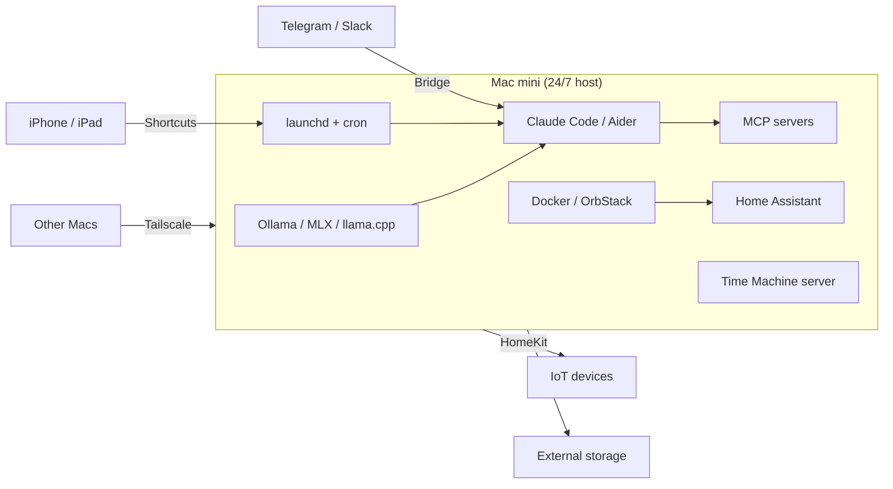

# Awesome Mac mini Home Server [](https://awesome.re)

> A curated list of tools, guides, and projects for running an Apple Silicon Mac mini as a 24/7 home server, with agentic AI as the headline focus.

<div align="center">

**[Agentic AI](#agentic-ai)**  ·  **[Self-Hosted Apps](#self-hosted-apps)**  ·  **[Media Servers](#media-servers)**  ·  **[Smart Home](#smart-home)**  ·  **[Quick Start](#quick-start)**

[](LICENSE)
[](CONTRIBUTING.md)
[](https://github.com/momenbasel/awesome-mac-mini-homeserver/actions/workflows/lint.yml)
[](https://github.com/momenbasel/awesome-mac-mini-homeserver/commits/main)

</div>

---

## Why a Mac mini?

Apple Silicon Mac mini is the highest performance-per-watt home server you can buy. Unified memory, Metal and ANE acceleration, silent fans, and native macOS daemons make it the ideal always-on host for local agents, self-hosted services, and home automation.

| Metric | Mac mini M4 | Typical x86 SFF |
|---|---|---|
| Idle power | 4-7 W | 15-35 W |
| Peak power | 65 W | 120-200 W |
| Unified memory ceiling | 64 GB | 64-128 GB (discrete, slow GPU path) |
| LLM inference (70B Q4) | Runs on 64 GB tier | Needs dedicated GPU |
| Fan noise at idle | Inaudible | Audible |
| Form factor | 5 x 5 x 2 in | Typically 8+ in |
| Built-in server daemons | SMB, AFP, HomeKit, Time Machine, AirPlay | None |

---

## Architecture at a glance



---

## Quick Start

Install a curated stack with the included CLI. Pick Agentic AI, Media Server, or Self-Hosted Productivity:

```bash
curl -fsSL https://raw.githubusercontent.com/momenbasel/awesome-mac-mini-homeserver/main/install.sh -o install.sh
chmod +x install.sh
./install.sh
```

Review [`install.sh`](install.sh) before running. Idempotent: safe to re-run. See [docs/agentic-quickstart.md](docs/agentic-quickstart.md) for the opinionated agentic build.

```text
+------------------------------------------------------------+
|                                                            |
|        AWESOME  MAC  MINI  HOME  SERVER  INSTALLER         |
|                                                            |
|         Agentic AI  -  Media  -  Self-Hosted Apps          |
|                                                            |
+------------------------------------------------------------+

Pick a stack to install (numbers separated by commas, e.g. 1,3 or all):

   1  Agentic AI          Ollama, Claude Code, Aider, Open WebUI, Langfuse,
                          Whisper.cpp, Jan, LM Studio, Enchanted, Msty

   2  Media Server        Jellyfin (native), Sonarr, Radarr, Prowlarr,
                          Bazarr, qBittorrent, Transmission

   3  Self-Hosted Apps    Vaultwarden, Paperless-ngx, Gitea,
                          Homepage dashboard
```

Non-interactive: `./install.sh agentic` / `media` / `selfhosted` / `all`.

---

## Legend

Tags appear at the end of each entry in square brackets.

| Tag | Meaning |
|---|---|
| `[AS]` | Apple Silicon only |
| `[Intel]` | Intel Mac only |
| `[U]` | Universal binary |
| `[D]` | Runs via Docker |
| `[N]` | macOS native |
| `[P]` | Paid or freemium |

---

## Contents

- [Agentic AI](#agentic-ai)
  - [Apple Silicon optimized (MLX / CoreML / ANE)](#apple-silicon-optimized-mlx--coreml--ane)
  - [Local LLM runtimes](#local-llm-runtimes)
  - [Agentic frameworks](#agentic-frameworks)
  - [Coding agents and AI IDEs](#coding-agents-and-ai-ides)
  - [Agent sandboxes](#agent-sandboxes)
  - [MCP servers](#mcp-servers)
  - [Agent gateways and LLMOps](#agent-gateways-and-llmops)
  - [Tool and integration platforms](#tool-and-integration-platforms)
  - [Document ingestion](#document-ingestion)
  - [Agent memory and RAG](#agent-memory-and-rag)
  - [Vector databases](#vector-databases)
  - [Browser and computer-use agents](#browser-and-computer-use-agents)
  - [Voice and multimodal agents](#voice-and-multimodal-agents)
  - [Agent UIs](#agent-uis)
  - [Orchestration and eventing](#orchestration-and-eventing)
  - [Observability](#observability)
  - [Image and video agents](#image-and-video-agents)
  - [Agent bridges](#agent-bridges)
- [Hardware](#hardware)
- [OS and base setup](#os-and-base-setup)
- [Remote access](#remote-access)
- [Containers and virtualization](#containers-and-virtualization)
- [Media servers](#media-servers)
- [Storage and NAS](#storage-and-nas)
- [Self-hosted apps](#self-hosted-apps)
- [Smart home](#smart-home)
- [Ad blocking and DNS](#ad-blocking-and-dns)
- [Reverse proxy and TLS](#reverse-proxy-and-tls)
- [Monitoring and observability](#monitoring-and-observability)
- [Automation and scheduling](#automation-and-scheduling)
- [Development environments](#development-environments)
- [Backup](#backup)
- [Security](#security)
- [Audio and AirPlay](#audio-and-airplay)
- [Game streaming](#game-streaming)
- [Torrents and Usenet](#torrents-and-usenet)
- [Photo and video](#photo-and-video)
- [Databases](#databases)
- [Dashboards](#dashboards)
- [Power and thermals](#power-and-thermals)
- [Bootstrap and dotfiles](#bootstrap-and-dotfiles)
- [CI/CD and build farms](#cicd-and-build-farms)
- [Networking](#networking)
- [Sleep, wake, and persistence](#sleep-wake-and-persistence)
- [CLI power tools](#cli-power-tools)
- [File transfer](#file-transfer)
- [Reference lists](#reference-lists)
- [Contributing](#contributing)

---

## Agentic AI

Mac mini is the ideal 24/7 host for local agents. Unified memory runs large models natively. Metal accelerates inference. `launchd` turns any script into an always-on worker. See [docs/ram-sizing-llm.md](docs/ram-sizing-llm.md) for model sizing per memory tier.

### Apple Silicon optimized (MLX / CoreML / ANE)

Tools that exploit the Mac mini's unique hardware - Neural Engine, Metal Performance Shaders, and unified memory - for the fastest or lowest-power inference possible.

- [CoreML Tools](https://github.com/apple/coremltools) - Convert PyTorch, TensorFlow, and ONNX models to CoreML for ANE and Metal execution. `[AS]` `[N]`
- [DiffusionKit](https://github.com/argmaxinc/DiffusionKit) - Argmax's on-device Stable Diffusion with MLX and CoreML. `[AS]` `[N]`
- [exo](https://github.com/exo-explore/exo) - Run a unified LLM cluster across multiple Apple devices at home. `[AS]` `[N]`
- [FastMLX](https://github.com/Blaizzy/fastmlx) - OpenAI-compatible high-performance server for MLX models. `[AS]` `[N]`
- [llamafile](https://github.com/Mozilla-Ocho/llamafile) - Single-binary LLM distribution with Apple Silicon acceleration. `[U]` `[N]`
- [ml-ane-transformers](https://github.com/apple/ml-ane-transformers) - Apple's reference transformer implementation optimized for the Neural Engine. `[AS]` `[N]`
- [MLX](https://github.com/ml-explore/mlx) - Apple's array framework for Apple Silicon unified memory. `[AS]` `[N]`
- [MLX-Audio](https://github.com/Blaizzy/mlx-audio) - TTS, STT, and speech-to-speech for MLX. `[AS]` `[N]`
- [MLX-LM](https://github.com/ml-explore/mlx-lm) - Run Llama, Mistral, Qwen, Phi via MLX with 4 and 8-bit quantization. `[AS]` `[N]`
- [mlx-vlm](https://github.com/Blaizzy/mlx-vlm) - Vision-language models on MLX (LLaVA, Qwen-VL, Pixtral). `[AS]` `[N]`
- [mlx-whisper](https://pypi.org/project/mlx-whisper/) - OpenAI Whisper ported to MLX for Apple Silicon native speed. `[AS]` `[N]`
- [swift-transformers](https://github.com/huggingface/swift-transformers) - Hugging Face Swift library for CoreML model inference. `[AS]` `[N]`
- [WhisperKit](https://github.com/argmaxinc/WhisperKit) - Argmax's CoreML-optimized Whisper with ANE acceleration. `[AS]` `[N]`

### Local LLM runtimes

- [GPUStack](https://github.com/gpustack/gpustack) - GPU cluster manager that auto-configures vLLM and SGLang workers across heterogeneous nodes. `[U]` `[N]` `[D]`
- [Jan](https://jan.ai) - Offline local AI chat with a polished native UI. `[AS]` `[N]`
- [llama.cpp](https://github.com/ggerganov/llama.cpp) - C/C++ inference engine with first-class Metal backend. `[U]` `[N]`
- [llama-swap](https://github.com/mostlygeek/llama-swap) - Go proxy that hot-swaps llama.cpp or any OpenAI-compatible backend on demand. `[U]` `[N]`
- [LM Studio](https://lmstudio.ai) - GUI for GGUF models with an OpenAI-compatible headless server. `[AS]` `[N]`
- [LocalAI](https://github.com/mudler/LocalAI) - OpenAI-compatible drop-in API for local models. `[D]`
- [Ollama](https://ollama.com) - One-command local LLM server, Metal-accelerated by default. `[U]` `[N]`
- [SGLang](https://github.com/sgl-project/sglang) - High-performance serving framework with structured-output and radix-cache scheduling. `[U]` `[D]`
- [vLLM](https://github.com/vllm-project/vllm) - High-throughput inference server, runs via Docker on Apple Silicon. `[D]`

### Agentic frameworks

- [Agno](https://github.com/agno-agi/agno) - Python runtime and AgentOS control plane for building, deploying, and operating agentic systems at scale. `[U]` `[N]` `[D]`
- [AgentScope](https://github.com/modelscope/agentscope) - Production-oriented multi-agent framework from Alibaba with built-in tool, memory, and voice abstractions. `[U]` `[N]`
- [Aider](https://aider.chat) - Terminal-native AI pair programmer with git-aware edits. `[U]` `[N]`
- [AutoGen](https://github.com/microsoft/autogen) - Multi-agent conversation framework from Microsoft. `[U]`
- [Claude Code](https://docs.claude.com/en/docs/claude-code) - Anthropic's terminal coding agent, scriptable via stdin and launchd. `[U]` `[N]`
- [Cline](https://cline.bot) - Autonomous coding agent for VS Code. `[U]`
- [Continue](https://continue.dev) - Open-source AI code assistant for IDEs. `[U]`
- [CrewAI](https://www.crewai.com) - Role-based multi-agent orchestration framework. `[U]`
- [DSPy](https://github.com/stanfordnlp/dspy) - Stanford framework for programming (not prompting) LMs via compiled modules and optimizers. `[U]` `[N]`
- [Goose](https://block.github.io/goose/) - Open-source on-machine AI agent by Block. `[U]` `[N]`
- [Inngest AgentKit](https://github.com/inngest/agent-kit) - TypeScript toolkit for building multi-agent networks on Inngest's durable runtime. `[U]` `[N]`
- [LangGraph](https://github.com/langchain-ai/langgraph) - Stateful multi-actor agent graphs. `[U]`
- [Mastra](https://github.com/mastra-ai/mastra) - TypeScript agent framework with workflows, RAG, and evals for shipping production agents. `[U]` `[N]`
- [mcp-agent](https://github.com/lastmile-ai/mcp-agent) - Python framework for composing agents purely out of MCP servers. `[U]` `[N]`
- [Microsoft Agent Framework](https://github.com/microsoft/agent-framework) - Enterprise successor to AutoGen with Python and .NET SDKs for multi-agent workflows. `[U]` `[N]`
- [Open Interpreter](https://www.openinterpreter.com) - Natural language interface that executes code locally. `[U]` `[N]`
- [OpenAI Agents SDK](https://github.com/openai/openai-agents-python) - Lightweight multi-agent orchestration SDK that succeeds Swarm, works with any OpenAI-compatible provider. `[U]` `[N]`
- [OpenHands](https://github.com/All-Hands-AI/OpenHands) - Autonomous software engineer agent platform. `[D]`
- [Pydantic AI](https://github.com/pydantic/pydantic-ai) - Type-safe Python agent framework from the Pydantic team. `[U]` `[N]`
- [smolagents](https://github.com/huggingface/smolagents) - Minimal agent library from Hugging Face. `[U]`
- [VoltAgent](https://github.com/VoltAgent/voltagent) - TypeScript agent-engineering framework with optional cloud console for observability. `[U]` `[N]` `[P]`
- [Fabric](https://github.com/danielmiessler/fabric) - Go CLI that applies reusable AI patterns to stdin for summarization, code review, and research. `[U]` `[N]`

### Coding agents and AI IDEs

- [Bolt.diy](https://github.com/stackblitz-labs/bolt.diy) - Community fork of StackBlitz Bolt for full-stack web app generation against any LLM. `[U]` `[N]`
- [Claude Agent SDK](https://github.com/anthropics/claude-agent-sdk-python) - Anthropic SDK for building custom agents on top of Claude Code with hooks and custom tools. `[U]` `[N]`
- [Gemini CLI](https://github.com/google-gemini/gemini-cli) - Open-source Google agent that brings Gemini or local models into the terminal with extensible tools. `[U]` `[N]`
- [Kilo Code](https://github.com/Kilo-Org/kilocode) - All-in-one agentic engineering platform available as VS Code extension and CLI. `[U]` `[N]`
- [OpenAI Codex CLI](https://github.com/openai/codex) - Lightweight terminal coding agent from OpenAI, works with local OpenAI-compatible endpoints. `[U]` `[N]`
- [Roo Code](https://github.com/RooCodeInc/Roo-Code) - VS Code extension with autonomous architect, code, debug, and custom agent modes. `[U]` `[N]`
- [SWE-agent](https://github.com/SWE-agent/SWE-agent) - Princeton/Stanford framework for LM agents that autonomously fix GitHub issues. `[U]` `[N]` `[D]`
- [Void](https://github.com/voideditor/void) - Open-source Cursor alternative built on VS Code with agentic editing and any-model support. `[U]` `[N]`
- [Zed](https://github.com/zed-industries/zed) - High-performance native macOS editor with first-class agent panel, MCP, and Metal-accelerated UI. `[AS]` `[N]`

### Agent sandboxes

- [Daytona](https://github.com/daytonaio/daytona) - Elastic runtime that spins up isolated dev-container sandboxes for agent code execution. `[U]` `[D]`
- [E2B](https://github.com/e2b-dev/E2B) - Open-source secure cloud sandboxes for running AI-generated code, self-hostable. `[U]` `[D]`

### MCP servers

- [awesome-mcp-servers](https://github.com/punkpeye/awesome-mcp-servers) - Community-curated catalog of MCP servers, the canonical discovery index. `[U]`
- [FastMCP](https://github.com/jlowin/fastmcp) - Pythonic framework for building MCP servers and clients with auto-generated schemas. `[U]` `[N]`
- [GitMCP](https://github.com/idosal/git-mcp) - Remote MCP server that grounds assistants in any public GitHub repo's docs and code. `[U]` `[N]`
- [Glama MCP Registry](https://glama.ai/mcp/servers) - Directory of 20k+ MCP servers filterable by language, transport, and category. `[U]`
- [MCP Filesystem](https://github.com/modelcontextprotocol/servers/tree/main/src/filesystem) - Official filesystem MCP server. `[U]`
- [MCP GitHub](https://github.com/modelcontextprotocol/servers/tree/main/src/github) - Official GitHub MCP server. `[U]`
- [MCP Puppeteer](https://github.com/modelcontextprotocol/servers/tree/main/src/puppeteer) - Browser automation via MCP. `[U]`
- [MCP reference servers](https://github.com/modelcontextprotocol/servers) - Official reference implementations (filesystem, git, fetch, memory, sequential-thinking). `[U]` `[N]`
- [mcp.run](https://www.mcp.run) - Registry and runtime for portable MCP servlets. `[U]`
- [Smithery](https://smithery.ai) - Largest open marketplace of MCP servers with one-command install into MCP clients. `[U]` `[P]`
- [Toolhive](https://github.com/stacklok/toolhive) - Secure MCP server manager. `[U]`

### Agent gateways and LLMOps

- [LiteLLM](https://github.com/BerriAI/litellm) - Unified OpenAI-compatible gateway and Python SDK fronting 100+ providers and local engines. `[U]` `[N]` `[D]`
- [OpenLLM](https://github.com/bentoml/OpenLLM) - BentoML project for serving open-source LLMs behind an OpenAI-compatible API. `[U]` `[N]` `[D]`
- [Portkey AI Gateway](https://github.com/Portkey-AI/gateway) - High-performance edge gateway that routes to 200+ LLMs with guardrails and fallbacks. `[U]` `[N]` `[D]`
- [promptfoo](https://github.com/promptfoo/promptfoo) - CLI and library for evaluating and red-teaming LLM apps with side-by-side comparisons. `[U]` `[N]`
- [TensorZero](https://github.com/tensorzero/tensorzero) - Rust-based LLMOps stack unifying gateway, observability, evals, and optimization. `[U]` `[N]` `[D]`
- [Weave](https://github.com/wandb/weave) - W&B's developer toolkit for tracing, evaluating, and debugging GenAI applications. `[U]` `[N]` `[P]`

### Tool and integration platforms

- [Composio](https://github.com/ComposioHQ/composio) - SDK providing 1000+ authenticated tool integrations and a sandboxed workbench for any agent framework. `[U]` `[N]` `[P]`

### Document ingestion

- [Crawl4AI](https://github.com/unclecode/crawl4ai) - Open-source web crawler and scraper that emits LLM-ready Markdown for RAG. `[U]` `[N]` `[D]`
- [Docling](https://github.com/docling-project/docling) - IBM-led document processor that converts PDFs, DOCX, PPTX, and images into structured layouts. `[U]` `[N]`
- [MarkItDown](https://github.com/microsoft/markitdown) - Microsoft utility that converts arbitrary files to clean Markdown for LLM pipelines. `[U]` `[N]`
- [Scrapling](https://github.com/D4Vinci/Scrapling) - Adaptive Python web scraping framework with stealth, anti-bot bypass, and full-crawl support. `[U]` `[N]`

### Agent memory and RAG

- [Cognee](https://github.com/topoteretes/cognee) - Knowledge engine giving agents persistent memory via combined vector and graph stores. `[U]` `[N]` `[D]`
- [Graphiti](https://github.com/getzep/graphiti) - Temporal knowledge-graph framework for tracking how facts change over time with provenance. `[U]` `[N]`
- [Kotaemon](https://github.com/Cinnamon/kotaemon) - Open-source document-chat UI with advanced citation and multi-modal retrieval. `[U]` `[N]` `[D]`
- [LangChain](https://github.com/langchain-ai/langchain) - LLM application framework. `[U]`
- [Letta](https://github.com/letta-ai/letta) - Stateful agents with long-term memory, formerly MemGPT. `[U]`
- [LlamaIndex](https://github.com/run-llama/llama_index) - Data framework for LLM applications. `[U]`
- [Mem0](https://github.com/mem0ai/mem0) - Memory layer for AI agents. `[U]`
- [Onyx](https://github.com/onyx-dot-app/onyx) - Self-hostable enterprise chat with agentic RAG, web search, and code execution over your data. `[U]` `[D]`
- [PaperQA](https://github.com/Future-House/paper-qa) - High-accuracy agentic RAG for scientific PDFs with iterative search and in-text citations. `[U]` `[N]`
- [RAGFlow](https://github.com/infiniflow/ragflow) - RAG engine with deep document parsing, intelligent chunking, and grounded citations. `[U]` `[D]`
- [Zep](https://www.getzep.com) - Long-term memory for AI agents. `[U]` `[D]`

### Vector databases

- [Chroma](https://www.trychroma.com) - Open-source embedding database. `[U]` `[D]`
- [LanceDB](https://lancedb.github.io/lancedb/) - Serverless vector database with native Metal support. `[AS]` `[U]`
- [pgvector](https://github.com/pgvector/pgvector) - Vector similarity search extension for Postgres. `[U]`
- [Qdrant](https://qdrant.tech) - Vector search engine with Docker support on Apple Silicon. `[D]`
- [Weaviate](https://weaviate.io) - Open-source vector database with hybrid search. `[D]`

### Browser and computer-use agents

- [Anthropic Computer Use](https://docs.claude.com/en/docs/build-with-claude/computer-use) - Claude API for controlling the desktop. `[U]`
- [browser-use](https://github.com/browser-use/browser-use) - Make websites accessible for AI agents. `[U]`
- [Camoufox](https://github.com/daijro/camoufox) - Stealth Firefox fork for undetected automation. `[U]`
- [OmniParser](https://github.com/microsoft/OmniParser) - Screen parsing for GUI agents. `[U]`
- [Playwright](https://playwright.dev) - Cross-browser automation library. `[U]` `[N]`
- [Skyvern](https://github.com/Skyvern-AI/skyvern) - Automate browser workflows with LLMs. `[D]`
- [Stagehand](https://github.com/browserbase/stagehand) - AI web browsing framework. `[U]`

### Voice and multimodal agents

- [Dia](https://github.com/nari-labs/dia) - 1.6B dialogue TTS with speaker control and emotion conditioning for multi-voice scenes. `[U]` `[N]`
- [Kokoro TTS](https://github.com/hexgrad/kokoro) - 82M-parameter open-weight TTS that hits top TTS-Arena quality while running fast on Apple Silicon. `[U]` `[N]`
- [Moshi](https://github.com/kyutai-labs/moshi) - Kyutai's real-time full-duplex speech-text foundation model. `[U]` `[N]`
- [OpenVoice](https://github.com/myshell-ai/OpenVoice) - Instant voice cloning. `[U]`
- [Parakeet](https://github.com/NVIDIA/NeMo) - NVIDIA ASR model, convertible to CoreML. `[U]`
- [Piper](https://github.com/rhasspy/piper) - Fast neural text-to-speech. `[U]` `[N]`
- [SenseVoice](https://github.com/FunAudioLLM/SenseVoice) - Multilingual speech understanding. `[U]`
- [Sesame CSM](https://github.com/SesameAILabs/csm) - Conversational speech model that produces RVQ audio codes from text and audio with a Llama backbone. `[U]` `[N]`
- [Ultravox](https://github.com/fixie-ai/ultravox) - Real-time speech-to-speech LLM. `[U]`
- [Whisper.cpp](https://github.com/ggerganov/whisper.cpp) - C/C++ port of Whisper with Metal acceleration. `[U]` `[N]`
- [WhisperX](https://github.com/m-bain/whisperX) - Whisper with speaker diarization. `[U]`

### Agent UIs

- [AnythingLLM](https://anythingllm.com) - Full-stack RAG application for any LLM. `[U]` `[D]`
- [Cherry Studio](https://github.com/CherryHQ/cherry-studio) - Cross-platform native desktop client with 300+ preconfigured assistants. `[U]` `[N]`
- [Enchanted](https://github.com/gluonfield/enchanted) - Native macOS UI for Ollama. `[AS]` `[N]`
- [LibreChat](https://www.librechat.ai) - Enhanced ChatGPT clone with multi-provider support. `[D]`
- [Msty](https://msty.app) - Native chat UI for local and remote models. `[U]` `[N]`
- [NextChat](https://github.com/ChatGPTNextWeb/NextChat) - Lightweight cross-platform chat client with plugin and MCP support. `[U]` `[N]`
- [Open WebUI](https://openwebui.com) - Extensible self-hosted AI interface. `[D]`
- [SillyTavern](https://github.com/SillyTavern/SillyTavern) - Locally installed unified frontend for many LLM APIs with deep customization. `[U]` `[N]`
- [Vane](https://github.com/ItzCrazyKns/Vane) - Privacy-focused self-hosted answering engine (ex-Perplexica) with web source citations. `[U]` `[N]` `[D]`

### Orchestration and eventing

- [Activepieces](https://www.activepieces.com) - Open-source Zapier alternative. `[D]`
- [Dagu](https://github.com/dagu-org/dagu) - Single-binary DAG-based cron replacement with web UI and YAML workflows. `[U]` `[N]` `[D]`
- [Huginn](https://github.com/huginn/huginn) - Build agents that perform automated tasks. `[D]`
- [Kestra](https://github.com/kestra-io/kestra) - Event-driven orchestration platform for scheduled and triggered workflows with 600+ plugins. `[U]` `[D]`
- [n8n](https://n8n.io) - Fair-code workflow automation with LLM nodes. `[D]`
- [Temporal](https://temporal.io) - Durable execution workflow engine. `[D]`
- [Trigger.dev](https://trigger.dev) - Open-source background job framework. `[D]`
- [Windmill](https://www.windmill.dev) - Developer platform for internal tools and workflows. `[D]`

### Observability

- [Helicone](https://github.com/Helicone/helicone) - Self-hosted LLM observability. `[D]`
- [Langfuse](https://langfuse.com) - Open-source LLM engineering platform. `[D]`
- [OpenLLMetry](https://github.com/traceloop/openllmetry) - OpenTelemetry for LLM apps. `[U]`
- [Phoenix](https://phoenix.arize.com) - ML observability from Arize. `[U]` `[D]`

### Image and video agents

- [ComfyUI](https://github.com/comfyanonymous/ComfyUI) - Node-based Stable Diffusion UI with Metal support. `[U]` `[N]`
- [Draw Things](https://drawthings.ai) - Apple Silicon native Stable Diffusion app with CLI. `[AS]` `[N]`
- [Fooocus](https://github.com/lllyasviel/Fooocus) - Simplified SDXL generation UI. `[U]`
- [InvokeAI](https://invoke-ai.github.io/InvokeAI/) - Professional Stable Diffusion platform. `[U]`

### Agent bridges

- [claude-code-telegram](https://github.com/richardbaxter/claude-code-telegram) - Telegram bridge for Claude Code. `[U]`
- [matterbridge](https://github.com/42wim/matterbridge) - Bridge between chat protocols. `[U]` `[N]`

---

## Hardware

Pick the right mini. Unified memory is not upgradeable, choose generously.

| Model | Year | Min RAM | Max RAM | Max storage | Notes |
|---|---|---|---|---|---|
| Mac mini M1 | 2020 | 8 GB | 16 GB | 2 TB | Great bargain, limited for 13B+ models |
| Mac mini M2 / M2 Pro | 2023 | 8 / 16 GB | 24 / 32 GB | 8 TB | Sweet spot for most home servers |
| Mac mini M4 / M4 Pro | 2024 | 16 / 24 GB | 32 / 64 GB | 8 TB | Best for agentic workloads and 70B models |

- [Macs Fan Control](https://crystalidea.com/macs-fan-control) - Monitor and override fan curves. `[U]` `[N]`
- [Network UPS Tools](https://networkupstools.org) - NUT client for safe shutdown with a UPS. `[U]` `[N]`
- [OWC Thunderbolt docks](https://www.owc.com/solutions/thunderbolt) - Quality hubs for storage and display expansion. `[U]`
- [Satechi stands](https://satechi.net) - Aluminum stands with USB-C passthrough. `[U]`

See [docs/hardware.md](docs/hardware.md) for detailed picks and sizing.

---

## OS and base setup

- [Auto-Login Settings](https://support.apple.com/guide/mac-help/set-your-mac-to-log-in-automatically-mh27627/mac) - Required for headless post-reboot startup. `[U]` `[N]`
- [BetterDisplay](https://github.com/waydabber/BetterDisplay) - Virtual display for headless Apple Silicon Macs. `[AS]` `[N]`
- [caffeinate(8)](https://ss64.com/osx/caffeinate.html) - Prevent sleep for a process or timeframe. `[U]` `[N]`
- [defaults(1)](https://ss64.com/osx/defaults.html) - Scriptable access to macOS preferences. `[U]` `[N]`
- [Headless Mac](https://github.com/dickreuter/headless_mac) - Curated settings for running Mac without a display. `[U]`
- [sharing(1)](https://ss64.com/osx/sharing.html) - Configure SMB, AFP, and Time Machine shares from CLI. `[U]` `[N]`

---

## Remote access

- [Blink Shell](https://blink.sh) - Best-in-class SSH/mosh client for iOS and iPadOS. `[P]`
- [Cloudflare Tunnel](https://developers.cloudflare.com/cloudflare-one/connections/connect-networks/) - Expose local services without opening ports via `cloudflared`. `[U]` `[N]`
- [mosh](https://mosh.org) - Mobile shell, survives roaming and sleep. `[U]` `[N]`
- [Tailscale](https://tailscale.com) - WireGuard-based mesh VPN with SSH, Funnel, and Serve. `[U]` `[N]`
- [WireGuard](https://www.wireguard.com) - Fast modern VPN, use `wg-quick` via launchd. `[U]` `[N]`
- [wush](https://github.com/coder/wush) - Ad-hoc P2P SSH and rsync over WireGuard using Tailscale DERP without a tailnet. `[U]` `[N]`

---

## Containers and virtualization

- [Apple Container](https://github.com/apple/container) - Apple's Swift-native Linux container runtime using lightweight VMs, optimized for Apple Silicon. `[AS]` `[N]`
- [Cilicon](https://github.com/traderepublic/Cilicon) - Self-hosted ephemeral macOS CI runner that clones APFS VM bundles for GitHub Actions and Buildkite. `[AS]` `[N]`
- [Colima](https://github.com/abiosoft/colima) - Container runtimes on Lima, fast Docker replacement. `[U]` `[N]`
- [CapRover](https://caprover.com) - One-click self-hosted PaaS on Docker Swarm with Nginx and Let's Encrypt. `[D]`
- [Coolify](https://coolify.io) - Self-hostable Heroku/Vercel alternative deploying apps and 280+ services over SSH. `[D]` `[P]`
- [Docker Desktop](https://www.docker.com/products/docker-desktop/) - Mainstream Docker on macOS with GUI. `[U]`
- [Dockge](https://github.com/louislam/dockge) - Reactive web UI dedicated to managing Docker Compose stacks. `[D]`
- [Lima](https://github.com/lima-vm/lima) - Linux VMs with automatic file sharing and port forwarding. `[U]` `[N]`
- [OrbStack](https://orbstack.dev) - Fast, light Docker and Linux VMs for macOS. `[AS]` `[N]` `[P]`
- [Parallels Desktop](https://www.parallels.com/products/desktop/) - Full commercial VM suite with server mode. `[U]` `[P]`
- [Portainer CE](https://www.portainer.io) - Web UI for managing Docker, Compose, Swarm, and Kubernetes containers. `[D]` `[P]`
- [Rancher Desktop](https://rancherdesktop.io) - Kubernetes and container management on the desktop. `[U]`
- [Tart](https://github.com/cirruslabs/tart) - Native Apple Silicon VMs for macOS and Linux guests. `[AS]` `[N]`
- [UTM](https://mac.getutm.app) - QEMU-based VMs with a native UI. `[U]` `[N]`
- [Arcane](https://github.com/ofkm/arcane) - Modern Go/Svelte Docker management UI covering images, volumes, networks, and Compose stacks. `[U]` `[D]`
- [Runtipi](https://github.com/runtipi/runtipi) - Personal home-server orchestrator with a one-click app store built on Docker Compose. `[U]` `[D]`

---

## Media servers

- [Audiobookshelf](https://audiobookshelf.org) - Self-hosted audiobook and podcast server with mobile apps. `[D]`
- [Channels DVR](https://getchannels.com) - DVR server for live TV. `[U]` `[P]`
- [Emby](https://emby.media) - Media server fork of MediaBrowser. `[U]` `[D]`
- [Ente](https://github.com/ente-io/ente) - End-to-end-encrypted self-hostable photos, auth, and locker. `[D]` `[AS]`
- [Jellyfin](https://jellyfin.org) - Free and open source media server. `[U]` `[D]`
- [Jellyseerr](https://seerr.dev) - Unified request and discovery manager for Jellyfin, Plex, and Emby. `[D]`
- [Komga](https://www.komga.org) - Self-hosted media server for comics, manga, and eBooks. `[D]`
- [Navidrome](https://navidrome.org) - Lightweight Subsonic/OpenSubsonic-compatible self-hosted music streaming. `[U]` `[N]` `[D]`
- [Plex Media Server](https://www.plex.tv) - The original streaming-first media server. `[U]` `[N]`
- [RomM](https://romm.app) - Self-hosted ROM manager with EmulatorJS and 400+ platforms. `[D]`
- [Tautulli](https://www.tautulli.com) - Python monitoring and analytics companion for Plex. `[U]` `[N]` `[D]`

---

## Storage and NAS

- [Mountain Duck](https://mountainduck.io) - Mount S3/SFTP/WebDAV volumes in Finder. `[U]` `[N]` `[P]`
- [OpenZFS on OS X](https://openzfsonosx.org) - ZFS filesystem for external storage pools. `[U]` `[N]`
- [Resilio Sync](https://www.resilio.com/individuals/) - P2P file sync without a cloud. `[U]`
- [rclone](https://rclone.org) - Rsync for cloud storage, 70+ backends. `[U]` `[N]`
- [Syncthing](https://syncthing.net) - Continuous file sync across devices. `[U]` `[N]`

---

## Self-hosted apps

### Productivity and notes

- [Actual Budget](https://actualbudget.org) - Envelope-budgeting personal finance app. `[D]`
- [AFFiNE](https://github.com/toeverything/AFFiNE) - Local-first open-source Notion/Miro alternative unifying docs, whiteboards, and databases. `[U]` `[D]` `[AS]`
- [AppFlowy](https://appflowy.com) - Open-source local-first Notion alternative with docs, wikis, tasks, and AI. `[U]` `[D]` `[AS]`
- [BookStack](https://www.bookstackapp.com) - Self-hosted wiki organized into Books, Chapters, and Pages with WYSIWYG editing. `[D]`
- [Docmost](https://docmost.com) - Confluence/Notion alternative with MCP support and diagramming. `[D]` `[P]`
- [Firefly III](https://firefly-iii.org) - Self-hosted double-entry personal finance manager with budgets, rules, and API. `[D]`
- [HedgeDoc](https://hedgedoc.org) - Real-time collaborative markdown editor, formerly CodiMD. `[D]`
- [Logseq](https://logseq.com) - Privacy-first local-first outliner and knowledge graph for daily notes and backlinks. `[U]` `[AS]`
- [Memos](https://usememos.com) - Self-hosted timeline for quick markdown notes, daily logs, and snippets. `[D]`
- [Mealie](https://mealie.io) - Recipe manager and meal planner with URL scraping and shopping lists. `[D]`
- [NocoDB](https://nocodb.com) - No-code Airtable alternative turning Postgres/MySQL into a spreadsheet UI. `[D]` `[P]`
- [Outline](https://www.getoutline.com) - Team knowledge base with real-time collaboration and AI search. `[D]` `[P]`
- [SilverBullet](https://silverbullet.md) - Programmable browser-based markdown PKM platform with Lua scripting. `[D]`
- [Trilium Next](https://github.com/TriliumNext/Notes) - Hierarchical self-hosted knowledge base with scripting, relations, and local-first sync. `[D]` `[U]`
- [Vikunja](https://vikunja.io) - Open-source task manager with list, kanban, Gantt, and table views. `[D]` `[P]`
- [Huly](https://github.com/hcengineering/platform) - All-in-one Linear, Jira, Slack, and Notion alternative with native arm64 containers. `[U]` `[D]`
- [Khoj](https://github.com/khoj-ai/khoj) - Self-hostable personal AI that answers across your notes, docs, and the web. `[U]` `[D]`
- [ToolJet](https://github.com/ToolJet/ToolJet) - Open-source low-code builder for internal tools and dashboards with 80+ data sources. `[D]`

### Files and documents

- [CryptPad](https://cryptpad.org) - End-to-end-encrypted collaborative office suite (docs, sheets, slides, kanban). `[D]`
- [Etherpad](https://etherpad.org) - Real-time collaborative plain-text editor with 290+ plugins. `[U]` `[N]` `[D]`
- [Filebrowser](https://github.com/filebrowser/filebrowser) - Single-binary web file manager for uploading, editing, and sharing files. `[U]` `[N]` `[D]`
- [Gitea](https://gitea.io) - Lightweight self-hosted git service. `[D]`
- [Forgejo](https://forgejo.org) - Community Gitea fork for self-hosted git. `[D]`
- [Immich](https://immich.app) - Google Photos replacement with ML. `[D]`
- [Nextcloud](https://nextcloud.com) - Full self-hosted cloud suite. `[D]`
- [Paperless-ngx](https://docs.paperless-ngx.com) - Document management with OCR. `[D]`
- [Stirling PDF](https://www.stirlingpdf.com) - 60+ PDF tools for merging, signing, converting, and OCR. `[U]` `[D]` `[P]`
- [Vaultwarden](https://github.com/dani-garcia/vaultwarden) - Lightweight Bitwarden server in Rust. `[D]`
- [Zoekt](https://github.com/sourcegraph/zoekt) - Trigram-indexed source code search with symbol-aware ranking. `[U]` `[N]` `[D]`
- [Gitleaks](https://github.com/gitleaks/gitleaks) - Single-binary secret scanner for git history and working trees. `[U]` `[N]`

### Reading and feeds

- [ArchiveBox](https://archivebox.io) - Self-hosted web archive preserving pages as HTML, PDF, PNG, and WARC. `[D]`
- [FreshRSS](https://freshrss.org) - Scalable self-hosted RSS/Atom aggregator with WebSub and mobile sync. `[D]`
- [Karakeep](https://karakeep.app) - AI-powered bookmark and read-it-later app. `[D]`
- [Miniflux](https://miniflux.app) - Minimalist RSS reader. `[D]`
- [Shiori](https://github.com/go-shiori/shiori) - Single-binary Go bookmark manager with content archival and Pocket import. `[U]` `[N]` `[D]`
- [Readeck](https://codeberg.org/readeck/readeck) - Single-binary Go read-it-later and bookmark manager with article extraction and full-text search. `[U]` `[N]` `[D]`
- [Wallabag](https://wallabag.org) - Self-hosted read-it-later app for saving, syncing, and reading web articles. `[D]`

### Analytics and monitoring

- [changedetection.io](https://changedetection.io) - Website change monitor with CSS/xPath filters and 85+ notification channels. `[D]` `[P]`
- [Plausible CE](https://plausible.io) - Cookieless, privacy-friendly web analytics. `[D]` `[P]`
- [PostHog](https://posthog.com) - Product analytics, session replay, feature flags, and experiments platform. `[D]` `[P]`
- [Rybbit](https://rybbit.com) - Modern cookieless analytics with session replay, funnels, and web vitals. `[D]` `[P]`
- [Medama](https://github.com/medama-io/medama) - Sub-1 KB cookieless analytics tracker delivered as a single Go binary. `[U]` `[N]` `[D]`
- [Umami](https://umami.is) - Simple, privacy-focused self-hosted web analytics. `[D]`
- [Vince](https://github.com/vinceanalytics/vince) - Plausible-style privacy analytics as one dependency-free Go binary with automatic TLS. `[U]` `[N]` `[D]`

### Mail, comms, and push

- [Conduit](https://conduit.rs) - Simple single-binary Rust Matrix homeserver with embedded RocksDB. `[U]` `[N]` `[D]`
- [docker-mailserver](https://github.com/docker-mailserver/docker-mailserver) - Production-ready containerized full mail stack. `[D]`
- [Gotify](https://gotify.net) - Self-hosted push-notification server with REST API and Android client. `[U]` `[N]` `[D]`
- [ntfy](https://ntfy.sh) - HTTP-based pub/sub push notification service, free public and self-hostable. `[U]` `[N]` `[D]`
- [Stalwart](https://stalw.art) - All-in-one Rust mail and collaboration server with SMTP, IMAP, JMAP, and CalDAV. `[U]` `[N]` `[D]`
- [Listmonk](https://github.com/knadh/listmonk) - Single-binary self-hosted newsletter and mailing-list manager backed by Postgres. `[U]` `[N]` `[D]`
- [Synapse](https://github.com/element-hq/synapse) - Reference Python implementation of the Matrix homeserver. `[D]`

### Network tunnels and zero-trust

- [Headscale](https://github.com/juanfont/headscale) - Self-hosted open-source implementation of the Tailscale coordination server. `[U]` `[N]` `[D]`
- [NetBird](https://netbird.io) - WireGuard-based zero-trust mesh VPN with SSO and policies. `[U]` `[N]` `[D]` `[P]`
- [Pangolin](https://github.com/fosrl/pangolin) - WireGuard-based identity-aware reverse proxy and remote-access platform with RBAC. `[D]` `[P]`
- [zrok](https://zrok.io) - OpenZiti-based peer-to-peer sharing and secure tunneling alternative to ngrok. `[U]` `[N]` `[D]`

### Privacy front-ends and search

- [Invidious](https://invidious.io) - Privacy-respecting alternative front-end for YouTube with RSS and API. `[D]`
- [SearXNG](https://docs.searxng.org) - Privacy-respecting metasearch engine aggregating up to 251 sources. `[D]`

---

## Smart home

- [ESPHome](https://esphome.io) - DIY firmware for ESP-based smart devices. `[U]`
- [HOOBS](https://hoobs.org) - Homebridge distribution with a web UI. `[U]` `[D]`
- [Home Assistant](https://www.home-assistant.io) - Leading open-source home automation platform. `[D]`
- [Homebridge](https://homebridge.io) - Bridge non-HomeKit accessories into Apple Home. `[U]` `[N]`
- [Frigate](https://frigate.video) - Local AI-driven NVR with real-time object detection and Home Assistant integration. `[D]`
- [Matterbridge](https://github.com/Luligu/matterbridge) - Node-based Matter plugin manager that bridges devices into Apple Home, Google, and Alexa. `[U]` `[N]` `[D]`
- [Node-RED](https://nodered.org) - Flow-based programming for automation. `[U]` `[N]` `[D]`
- [python-matter-server](https://github.com/home-assistant-libs/python-matter-server) - Reference Matter controller WebSocket server used by Home Assistant. `[U]` `[D]`
- [RuView](https://github.com/ruvnet/RuView) - WiFi DensePose: camera-free human pose, presence, and vital-sign monitoring over commodity WiFi. `[U]`
- [Scrypted](https://scrypted.app) - HomeKit Secure Video bridge for existing cameras. `[U]` `[N]` `[D]`
- [Viseron](https://github.com/roflcoopter/viseron) - Self-hosted local-only NVR with object detection, motion detection, and face recognition. `[D]`
- [Z-Wave JS UI](https://github.com/zwave-js/zwave-js-ui) - Z-Wave controller UI. `[D]`

---

## Ad blocking and DNS

- [AdGuard Home](https://adguard.com/en/adguard-home/overview.html) - Network-wide ad and tracker blocker. `[U]` `[N]`
- [dnsmasq](https://thekelleys.org.uk/dnsmasq/doc.html) - Lightweight DNS, DHCP, TFTP. `[U]` `[N]`
- [NextDNS](https://nextdns.io) - Cloud DNS with filtering and analytics. `[U]`
- [Pi-hole](https://pi-hole.net) - DNS sinkhole, Docker on macOS. `[D]`
- [Unbound](https://nlnetlabs.nl/projects/unbound/about/) - Validating, recursive DNS resolver. `[U]` `[N]`

---

## Reverse proxy and TLS

- [Caddy](https://caddyserver.com) - Web server with automatic HTTPS. `[U]` `[N]`
- [cloudflared](https://github.com/cloudflare/cloudflared) - Cloudflare Tunnel client, no open ports required. `[U]` `[N]`
- [nginx](https://nginx.org) - Mature high-performance reverse proxy. `[U]` `[N]`
- [Tailscale Serve](https://tailscale.com/kb/1242/tailscale-serve) - Publish services on the tailnet with TLS. `[U]` `[N]`
- [Reproxy](https://github.com/umputun/reproxy) - Single-binary edge proxy with Docker discovery, Let's Encrypt, and Prometheus metrics. `[U]` `[N]` `[D]`
- [Traefik](https://traefik.io) - Cloud-native reverse proxy with auto-discovery. `[D]`

---

## Monitoring and observability

- [Beszel](https://github.com/henrygd/beszel) - Lightweight hub-and-agent server monitoring with native arm64 macOS agent. `[U]` `[N]` `[D]`
- [Dozzle](https://github.com/amir20/dozzle) - Real-time web log viewer for Docker, Colima, and OrbStack. `[D]`
- [Gatus](https://gatus.io) - Developer-focused self-hosted health-check and status page driven by YAML. `[U]` `[N]` `[D]`
- [Glances](https://nicolargo.github.io/glances/) - Cross-platform system monitor with a web UI. `[U]` `[N]`
- [Grafana](https://grafana.com/oss/grafana/) - Dashboards for any time-series backend. `[D]`
- [Netdata](https://www.netdata.cloud) - Real-time performance monitoring. `[U]` `[N]` `[D]`
- [NeoHtop](https://github.com/Abdenasser/neohtop) - Notarized Rust + Tauri process viewer that replaces Activity Monitor. `[U]` `[N]`
- [node_exporter](https://github.com/prometheus/node_exporter) - Prometheus exporter for host metrics. `[U]` `[N]`
- [Prometheus](https://prometheus.io) - Time-series database and monitoring system. `[D]`
- [Healthchecks](https://github.com/healthchecks/healthchecks) - Dead-man's-switch monitoring for cron and launchd jobs with 25+ notifiers. `[D]`
- [rustnet](https://github.com/domcyrus/rustnet) - Rust TUI network monitor with DPI and per-process attribution. `[U]` `[N]`
- [SigNoz](https://github.com/SigNoz/signoz) - OpenTelemetry-native unified logs, metrics, and traces backend. `[D]`
- [Uptime Kuma](https://github.com/louislam/uptime-kuma) - Self-hosted uptime monitoring. `[D]`

---

## Automation and scheduling

- [cron](https://ss64.com/osx/crontab.html) - Classic scheduler, still fine for simple jobs. `[U]` `[N]`
- [Keyboard Maestro](https://www.keyboardmaestro.com) - Powerful macro automation. `[U]` `[N]` `[P]`
- [LaunchControl](https://www.soma-zone.com/LaunchControl/) - Polished GUI for launchd job management. `[U]` `[N]` `[P]`
- [launchd](https://developer.apple.com/library/archive/documentation/MacOSX/Conceptual/BPSystemStartup/Chapters/CreatingLaunchdJobs.html) - macOS native service manager, use instead of cron. `[U]` `[N]`
- [shortcuts(1)](https://support.apple.com/guide/shortcuts-mac/intro-to-the-shortcuts-command-line-tool-apd455c82f02/mac) - Invoke Apple Shortcuts from CLI to chain agents. `[U]` `[N]`

---

## Development environments

- [code-server](https://github.com/coder/code-server) - VS Code in the browser. `[U]` `[D]`
- [Devbox](https://www.jetify.com/devbox/) - Isolated shells from Nix packages. `[U]` `[N]`
- [Homebrew](https://brew.sh) - The missing package manager for macOS. `[U]` `[N]`
- [JetBrains Gateway](https://www.jetbrains.com/remote-development/gateway/) - Remote JetBrains IDEs. `[U]`
- [nix-darwin](https://github.com/LnL7/nix-darwin) - Declarative macOS configuration with Nix. `[U]` `[N]`

---

## Backup

- [Arq](https://www.arqbackup.com) - Backup to any cloud with client-side encryption. `[U]` `[N]` `[P]`
- [Borg](https://www.borgbackup.org) - Deduplicating encrypted backup. `[U]` `[D]`
- [Kopia](https://kopia.io) - Fast encrypted snapshot backup. `[U]` `[N]`
- [restic](https://restic.net) - Fast, secure, efficient backup program. `[U]` `[N]`
- [shallow-backup](https://github.com/alichtman/shallow-backup) - Snapshot dotfiles, Brewfile, pip/npm/cargo lists, and VS Code extensions to a git repo. `[U]` `[N]`
- [Time Machine](https://support.apple.com/guide/mac-help/back-up-your-mac-with-time-machine-mh11421/mac) - Native macOS backup, can serve as a network target. `[U]` `[N]`

---

## Security

- [Authentik](https://goauthentik.io) - Self-hosted identity provider supporting OAuth2/OIDC, SAML, LDAP, and passkeys. `[D]`
- [Bitwarden Self-Host](https://bitwarden.com/help/install-on-premise-manual/) - Official Bitwarden server for password, passkey, and Secrets Manager. `[D]` `[P]`
- [ClamAV](https://www.clamav.net) - Open-source antivirus engine. `[U]` `[N]`
- [CrowdSec](https://www.crowdsec.net) - Open-source collaborative IPS with crowdsourced blocklists and bouncers. `[U]` `[N]` `[D]`
- [FileVault](https://support.apple.com/guide/mac-help/protect-data-on-your-mac-with-filevault-mh11785/mac) - Full-disk encryption built into macOS. `[U]` `[N]`
- [Infisical](https://infisical.com) - Open-source secrets, certificates, and PAM platform with CLI, SDKs, and K8s operator. `[D]` `[P]`
- [KnockKnock](https://objective-see.org/products/knockknock.html) - Enumerates every launchd and persistence vector, invaluable before opening a mini to the internet. `[U]` `[N]`
- [Little Snitch](https://obdev.at/products/littlesnitch/index.html) - Host-based application firewall. `[U]` `[N]` `[P]`
- [LuLu](https://objective-see.org/products/lulu.html) - Free macOS firewall by Objective-See. `[U]` `[N]`
- [osquery](https://osquery.io) - SQL-powered operating system instrumentation. `[U]` `[N]`
- [Pareto Security](https://github.com/ParetoSecurity/pareto-mac) - Automated baseline audit covering FileVault, firewall, Gatekeeper, SSH, and updates. `[U]` `[N]`
- [Pocket ID](https://github.com/pocket-id/pocket-id) - Minimalist OIDC provider built around passkey-only authentication. `[U]` `[N]` `[D]`
- [age](https://github.com/FiloSottile/age) - Modern composable file-encryption CLI with YubiKey plugins and SSH-key support. `[U]` `[N]`
- [Santa](https://github.com/google/santa) - Binary authorization framework by Google. `[U]` `[N]`
- [SOPS](https://github.com/getsops/sops) - Mozilla secrets-in-git tool that encrypts YAML/JSON/ENV leaves with age, PGP, or cloud KMS. `[U]` `[N]` `[D]`
- [TinyAuth](https://github.com/steveiliop56/tinyauth) - Lightweight forward-auth middleware that adds SSO in front of Traefik, Caddy, or nginx. `[U]` `[N]` `[D]`

---

## Audio and AirPlay

- [Music Assistant](https://music-assistant.io) - Music library manager with multi-provider streaming. `[D]`
- [Roon Core](https://roon.app) - High-fidelity music management server. `[U]` `[N]` `[P]`
- [shairport-sync](https://github.com/mikebrady/shairport-sync) - AirPlay audio receiver. `[U]`

---

## Game streaming

- [Moonlight](https://moonlight-stream.org) - Client for NVIDIA GameStream and Sunshine hosts. `[U]` `[N]`
- [Parsec](https://parsec.app) - Low-latency remote desktop for gaming. `[U]` `[N]`
- [Steam Link](https://store.steampowered.com/app/353380/Steam_Link/) - Stream Steam games across the LAN. `[U]`
- [Sunshine](https://github.com/LizardByte/Sunshine) - Self-hosted GameStream host. `[U]` `[D]`

---

## Torrents and Usenet

- [Bazarr](https://www.bazarr.media) - Companion to Sonarr/Radarr for subtitles. `[D]`
- [NZBGet](https://nzbget.com) - Efficient Usenet downloader in C++. `[D]`
- [Prowlarr](https://prowlarr.com) - Indexer manager for the *arr suite. `[D]`
- [qBittorrent](https://www.qbittorrent.org) - Free and open-source BitTorrent client. `[U]` `[N]` `[D]`
- [Radarr](https://radarr.video) - Movie collection manager. `[D]`
- [SABnzbd](https://sabnzbd.org) - Python-based Usenet downloader. `[U]` `[N]`
- [Sonarr](https://sonarr.tv) - TV series collection manager. `[D]`
- [Transmission](https://transmissionbt.com) - Minimal BitTorrent client. `[U]` `[N]`

---

## Photo and video

- [Final Cut Pro render node](https://support.apple.com/guide/final-cut-pro/share-projects-to-compressor-ver6b5b30efb/mac) - Use the mini as a Compressor rendering host. `[AS]` `[N]` `[P]`
- [LibrePhotos](https://github.com/LibrePhotosApp/LibrePhotos) - Open-source photo management with ML. `[D]`
- [PhotoPrism](https://www.photoprism.app) - AI-powered photos app for browsers, mobile, and TVs. `[D]`

---

## Databases

- [DuckDB](https://duckdb.org) - In-process analytical OLAP database. `[U]` `[N]`
- [MariaDB](https://mariadb.org) - Open-source MySQL fork. `[U]` `[N]` `[D]`
- [Postgres.app](https://postgresapp.com) - Postgres as a macOS app, no config required. `[U]` `[N]`
- [Redis](https://redis.io) - In-memory data store. `[U]` `[N]` `[D]`

---

## Dashboards

- [Dashy](https://dashy.to) - Feature-rich homepage for your server. `[D]`
- [Heimdall](https://heimdall.site) - Application dashboard for all your apps. `[D]`
- [Homarr](https://homarr.dev) - Sleek dashboard with real-time widgets. `[D]`
- [Homepage](https://gethomepage.dev) - Modern, fast, highly customizable dashboard. `[D]`
- [Homer](https://github.com/bastienwirtz/homer) - Dead-simple static YAML-driven homepage dashboard. `[U]` `[D]`

---

## Power and thermals

- [asitop](https://github.com/tlkh/asitop) - Python nvtop-style CLI surfacing E/P-cluster, GPU, and ANE power via `powermetrics`. `[AS]` `[N]`
- [macmon](https://github.com/vladkens/macmon) - Sudoless Rust TUI and Prometheus metrics server for M-series power, temperature, and bandwidth. `[AS]` `[N]`
- [mactop](https://github.com/context-labs/mactop) - Go-based terminal dashboard for Apple Silicon CPU, GPU, RAM, and power with sparklines. `[AS]` `[N]`
- [pmset(1)](https://ss64.com/osx/pmset.html) - macOS power management configuration. `[U]` `[N]`
- [powermetrics(1)](https://ss64.com/osx/powermetrics.html) - Live CPU/GPU/ANE power telemetry. `[U]` `[N]`
- [SMC Fan Control](https://github.com/hholtmann/smcFanControl) - Override fan speeds on Intel Macs. `[Intel]` `[N]`
- [Stats](https://github.com/exelban/stats) - Open-source macOS menu bar monitor for CPU, GPU, memory, network, disks, sensors, and fan RPM. `[U]` `[N]`
- [TG Pro](https://www.tunabellysoftware.com/tgpro/) - Temperature monitoring and fan control. `[U]` `[N]` `[P]`

See [docs/power-management.md](docs/power-management.md) for `pmset` tuning and UPS setup.

---

## Bootstrap and dotfiles

- [dotbot](https://github.com/anishathalye/dotbot) - Bootstrap a dotfiles setup with YAML. `[U]`
- [Homebrew Bundle](https://github.com/Homebrew/homebrew-bundle) - Install from a `Brewfile` manifest. `[U]` `[N]`
- [mac-dev-setup](https://github.com/sb2nov/mac-dev-setup) - Classic dev bootstrap guide. `[U]`
- [mas](https://github.com/mas-cli/mas) - Mac App Store CLI that lets a Brewfile install App Store apps headlessly. `[U]` `[N]`
- [strap](https://github.com/MikeMcQuaid/strap) - Bootstrap a new macOS machine. `[U]`

---

## CI/CD and build farms

Mac mini is a first-class iOS/macOS CI runner. These tools let a single mini (or a cluster) host build agents for GitHub Actions, Buildkite, Jenkins, and GitLab.

- [Buildkite Agent](https://buildkite.com/docs/agent/v3/macos) - Apple-Silicon-native CI agent with `launchd` spawn support for multi-runner minis. `[U]` `[N]`
- [fastlane](https://github.com/fastlane/fastlane) - iOS and Android release automation toolchain that pairs with any macOS CI runner. `[U]` `[N]`
- [GitHub Actions Runner](https://github.com/actions/runner) - Official self-hosted runner shipping arm64 macOS binaries. `[U]` `[N]`
- [Xcodes.app](https://github.com/XcodesOrg/XcodesApp) - GUI companion that manages multiple Xcodes and platform runtimes. `[U]` `[N]`
- [xcodes](https://github.com/XcodesOrg/xcodes) - CLI that installs and switches between Xcode versions, essential for pinned CI images. `[U]` `[N]`

---

## Networking

- [iperf3](https://iperf.fr/) - Canonical TCP/UDP throughput tester, arm64 via Homebrew. `[U]` `[N]`
- [mDNS-discovery](https://github.com/lukszar/mDNS-discovery) - Bash script that enumerates every Bonjour service on the LAN. `[U]` `[N]`
- [mDNSResponder](https://github.com/apple-oss-distributions/mDNSResponder) - Apple's open-source Bonjour daemon and `dns-sd` CLI. `[U]` `[N]`
- [MinIO Community](https://min.io) - S3-compatible open-source object storage server. `[U]` `[N]` `[D]` `[P]`
- [Wireshark](https://www.wireshark.org) - Apple-Silicon-native packet capture and analysis. `[U]` `[N]`

---

## Sleep, wake, and persistence

- [Amphetamine](https://apps.apple.com/us/app/amphetamine/id937984704) - Mac App Store utility with rich triggers that complements `caffeinate`. `[U]` `[N]`
- [SleepWatcher](https://www.bernhard-baehr.de/) - Long-lived daemon that runs scripts on sleep, wake, display dim, and idle timeouts. `[U]` `[N]`
- [wake-my-nas](https://github.com/dgeske/wake-my-nas) - macOS LaunchAgent that wakes a NAS by magic packet whenever the mini wakes. `[U]` `[N]`

---

## CLI power tools

Tools that make SSH-first Mac mini administration bearable.

- [duf](https://github.com/muesli/duf) - Modern colorized `df` replacement with JSON output. `[U]` `[N]`
- [git-cliff](https://github.com/orhun/git-cliff) - Rust changelog generator for Conventional Commits. `[U]` `[N]`
- [glow](https://github.com/charmbracelet/glow) - Terminal markdown reader for browsing runbooks over SSH. `[U]` `[N]`
- [HTTPie](https://github.com/httpie/cli) - Human-friendly HTTP client for debugging self-hosted APIs. `[U]` `[N]`
- [lnav](https://lnav.org) - Terminal log navigator with SQL querying over rotated logs. `[U]` `[N]`
- [m-cli](https://github.com/rgcr/m-cli) - Swiss-army CLI wrapping 40+ macOS admin tasks. `[U]` `[N]`
- [Miller](https://github.com/johnkerl/miller) - awk/sed/cut for CSV, TSV, and JSON as a single Go binary. `[U]` `[N]`
- [Nushell](https://www.nushell.sh) - Structured-data modern shell for scripting server pipelines. `[U]` `[N]`
- [yq](https://github.com/mikefarah/yq) - jq-compatible processor for YAML, JSON, TOML, XML. `[U]` `[N]`
- [zoxide](https://github.com/ajeetdsouza/zoxide) - Rust `cd` that learns frequent directories. `[U]` `[N]`

---

## File transfer

- [croc](https://github.com/schollz/croc) - PAKE-encrypted CLI file-transfer with resumable transfers. `[U]` `[N]` `[D]`
- [Magic Wormhole](https://github.com/magic-wormhole/magic-wormhole) - Python CLI that transfers files between machines using short phonetic codes. `[U]` `[N]`

---

## Reference lists

- [awesome-homelab](https://github.com/awesome-foss/awesome-sysadmin) - Sysadmin tooling inspiration.
- [awesome-macOS](https://github.com/iCHAIT/awesome-macOS) - Apps and tools for macOS in general.
- [awesome-macos-command-line](https://github.com/herrbischoff/awesome-macos-command-line) - Shell tricks and CLI one-liners for macOS power users.
- [awesome-macos-server](https://github.com/enzo-zsh/awesome-macos-server) - Related curated list focused on turning any Mac into a server.
- [awesome-selfhosted](https://github.com/awesome-selfhosted/awesome-selfhosted) - Broad self-hosted software list.
- [geerlingguy/mini-rack](https://github.com/geerlingguy/mini-rack) - Jeff Geerling's open-source 10-inch rack designs sized for Mac mini clusters.
- [open-source-mac-os-apps](https://github.com/serhii-londar/open-source-mac-os-apps) - Large catalogue of open-source macOS apps.

---

## Contributing

Contributions are very welcome. Read the [contribution guidelines](CONTRIBUTING.md) first. Every entry must pass `awesome-lint` and have a one-sentence description ending with a period.

## License

[](http://creativecommons.org/publicdomain/zero/1.0/)

To the extent possible under law, the maintainers have waived all copyright and related rights to this work.
